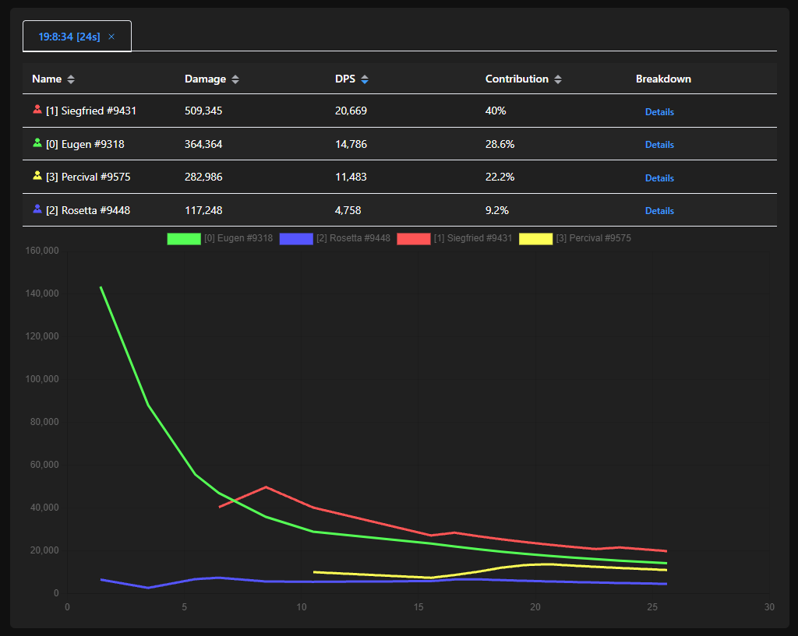

# GBFR-ACT-English

This is a forked version of [this repo](https://github.com/nyaoouo/GBFR-ACT).
The main goal of this version is an english translation and UI improvements.

## Granblue Fantasy Relink - Analytics for Combat Tracking

### Changes

   - Character names are displayed in english.
   - Now dark themed.
   - Numbers have comma separators.
   - Displays damage contribution as a percent.
   - Removed the 'recent damage' and 'recent dps' columns.

### Setup Steps

1. **Install Python 3.11**
   - Download link: [https://www.python.org/ftp/python/3.11.6/python-3.11.6-amd64.exe](https://www.python.org/ftp/python/3.11.6/python-3.11.6-amd64.exe)
   - Note: It is recommended to install with administrator privileges.
   - Note 2: This script does not support conda environments well, it is advised not to use conda environments.
   - Note 3: Having multiple versions of Python installed may cause conflicts.

2. **Download ZIP**
   - Click on the green `<> Code` dropdown menu near the top of this repo and then `Download ZIP`
   - Note: It's generally simplest to have the folder on your desktop, but is not necessary.

3. **Run act_ws.py or uac_start.cmd**
   - Double-click `act_ws.py` or `uac_start.cmd` to run. If there are no issues, a cmd window will pop up indicating that ACT has been successfully installed.
   - Note: Your folder may need to be in the same directory as Python to resolve certain issues.
   - Note 2: The `PermissionError` can generally be ignored, even on a successful install you may see this message in your cmd window.
   - Note 3: The windows brought up by running `act_ws.py` or `uac_start.cmd` can be closed after the socket successfully connects (you will still need to run either of these again when restarting the game).

4. **Open act_ws.html**
   - It is recommended to use Chrome browser to open `act_ws.html`.
   - Note: People have reported it is also working on Edge and Opera (and likely will on others).
  
### Issues
   - Does not attribute debuff damage (such as burn or poison) to anyone.
   - Details columns are not translated - names are just id numbers or in chinese (hopefully changed soon:tm:).